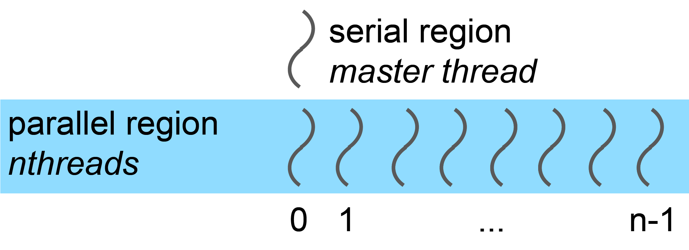

First Steps in OpenMP
---------------------

.. objectives::
    - Parallel and serial regions
    - Master thread and teams of threads
    - Directives and library functions
    - Controlling the number of threads
    - Timing OpenMP codes

Shared Memory Programming
^^^^^^^^^^^^^^^^^^^^^^^^^

Shared memory programming is widely deployed in scientific computing due to the prevalence of multicore processors and 
multithreaded processing cores.

**Historical Context**

- Shared memory hardware was very expensive 20 years ago
- Inexpensive these days
- Contemporary laptops have between 2 and 8 cores

**Programming Options**

There are several ways to program shared memory systems:

- **Posix threads** (typically C, C++)
- **OpenMP** (C, C++, Fortran)
- **Threaded languages** (e.g., Java)

Shared Memory Architecture
^^^^^^^^^^^^^^^^^^^^^^^^^^

In shared memory architecture, threads placed on several processing elements manipulate the same shared memory space.

**Advantages:**

- Easy to move data between threads
- Write result to shared memory on one processor
- Read on a different processor

**Considerations:**

- Care is needed regarding order (e.g., P0 needs to write before P2 can read)
- Read/write to shared memory has typically higher cost than manipulating registers/cache
- This creates communication overhead

OpenMP Resources
^^^^^^^^^^^^^^^^

**Official Resources**

- OpenMP is trademarked by the OpenMP ARB (a not-for-profit corporation)
- Website: http://openmp.org
- Standard specifications (free): http://www.openmp.org/specifications/

**Free Tutorials**

- YouTube playlist: https://www.youtube.com/playlist?list=PLLX-Q6B8xqZ8n8bwjGdzBJ25X2utwnoEG
- LLNL tutorial: https://computing.llnl.gov/tutorials/openMP/

**Textbooks**

1. **Using OpenMP** (OpenMP 2.5)
   
   :Authors: B Chapman, G Jost, R van der Pas
   :Publisher: MIT Press, Cambridge, Massachusetts, 2008

2. **Using OpenMP – The next Step** (OpenMP 4.5)
   
   :Authors: R van der Pas, E Stolzer, C Terboven
   :Publisher: MIT Press, Cambridge, Massachusetts, 2017

Threads in OpenMP
^^^^^^^^^^^^^^^^^

**Execution Model**

Program execution follows a fork-join model:

1. **Start:** Program execution starts single-threaded (master thread)
2. **Fork:** When entering a parallel region, a team of threads is created
3. **Parallel work:** Each thread executes an independent instruction stream
4. **Join:** At the end of parallel region, threads join and synchronization occurs
5. **Continue:** Single thread continues execution

Different parallel regions can have different numbers of threads.

.. figure:: img/parallel_construct.png
    :align: center
    :scale: 30%

**OpenMP: Directive Based**

OpenMP is based on compiler directives that control parallel execution.

In C and C++, an OpenMP pragma has the following form:

.. code-block:: c

    #pragma omp directive-name [clause[ [,] clause] ... ] new-line

A compiler typically supports several types of pragmas, not just OpenMP pragmas.
Therefore, all OpenMP pragmas begin with the keywords :code:`#pragma omp`.
The :code:`directive-name` placeholder specifies the used OpenMP construct (e.g. :code:`parallel`) and a pragma is always followed by a new line.
Typically, a pragma affects the user code that follows it but some OpenMP pragmas are *stand-alone*.
You can span a pragma across multiple lines by using a backslash (``\ ``) immediately followed by a new line:

.. code-block:: c

    #pragma omp directive-name \
        [clause[ [,] \
        clause] ... ] new-line

- **In Fortran:** Directives are special comments
- **In C/C++:** Directives are ``#pragma`` statements
- Directives are ignored by compilers without OpenMP support or when OpenMP is not enabled
- This makes it easy to maintain a single source version for both serial and parallel execution
- OpenMP also facilitates conditional compilation

**OpenMP Directives in Fortran**

*Free Format*

.. code-block:: fortran

    !$omp directive_name [clause […]]

*Fixed Format*

Directives always start in column 1:

.. code-block:: fortran

    !$omp directive_name [clause […]]
    c$omp directive_name [clause […]]
    *$omp directive_name [clause […]]

The first piece (e.g., ``!$omp``) is called the **sentinel**.

**Line Continuation**

*Free format example:*

.. code-block:: fortran

    !$omp parallel do &
    !$omp shared(a,b)

*Fixed format example:*

.. code-block:: fortran

    c$omp parallel do
    c$ompa shared(a,b)
    c$ompb schedule(dynamic)

.. note::
   A non-blank character in column 6 marks a continuation line.

**OpenMP Directives in C/C++**

.. code-block:: c

    #pragma omp directive_name [clause […]]

**Line Continuation**

Use backslash ``\`` for line continuation.

- **Directive name:** Specifies the action
- **Clause(s):** Allow further specification

Library Functions
^^^^^^^^^^^^^^^^^

In addition to directives, OpenMP offers library functions mainly to control the operating environment.

**Including Headers**

*In C:*

.. code-block:: c

    #include <omp.h>

*In Fortran:*

.. code-block:: fortran

    include "omp_lib.h"

or

.. code-block:: fortran

    use omp_lib

Conditional Compilation
^^^^^^^^^^^^^^^^^^^^^^^

OpenMP compilers define the preprocessor macro ``_OPENMP``.

*C Example*

.. code-block:: c

    #ifdef _OPENMP
    #include <omp.h>
    #endif

*Fortran Example*

Lines starting with ``!$`` (free format) or ``!$``, ``*$``, ``c$`` (fixed format) are only compiled if OpenMP is active:

.. code-block:: fortran

    !$ use omp_lib

.. note::
   This guard is required if code needs to be compiled serially.

The ``parallel`` Construct in Fortran
^^^^^^^^^^^^^^^^^^^^^^^^^^^^^^^^^^^^^

The most important construct in OpenMP.

.. code-block:: fortran

    !$omp parallel
        structured block of Fortran
    !$omp end parallel

- Starts a team of threads working on the block between the directives
- At the end of the parallel region, there's an implicit synchronization (wait for the last thread)

**First Example**

.. code-block:: fortran

    program example
        implicit none
        
        print *, "3+5=", 3+5
        
        !$omp parallel
        print *, "6+7=", 6+7
        !$omp end parallel
        
    end program example

**Execution:**

- First portion executed on master thread (prints "3+5=" once)
- Parallel construct creates threads
- Each thread performs addition and prints "6+7="
- Code also compiles serially (without OpenMP)

The ``parallel`` Construct in C
^^^^^^^^^^^^^^^^^^^^^^^^^^^^^^^

.. code-block:: c

    #pragma omp parallel
    {
        structured block of C instructions
    }

- Starts a team of threads working on the block enclosed with ``{ }`` in parallel
- At the end of the parallel region, there's an implicit synchronization (wait for the last thread)

**First Example**

.. code-block:: c

    int main()
    {
        printf("3+5=%i\n", 3+5);
        
        #pragma omp parallel
        {
            printf("6+7=%i\n", 6+7);
        }
        
        return 0;
    }

**Execution:**

- First portion executed on master thread (prints "3+5=" once)
- Parallel construct creates threads
- Each thread performs addition and prints "6+7="

Controlling the Number of Threads
^^^^^^^^^^^^^^^^^^^^^^^^^^^^^^^^^

The number of threads started by a parallel construct can be controlled in several ways (listed by increasing priority):

1. Environment Variable

.. code-block:: bash

    export OMP_NUM_THREADS=n

2. Function Call

.. code-block:: c

    omp_set_num_threads(n);

3. Clause on Parallel Construct (Highest Priority)

**Fortran:**

.. code-block:: fortran

    !$omp parallel num_threads(n)

**C:**

.. code-block:: c

    #pragma omp parallel num_threads(n)

**Thread Number and Thread ID query Functions**

These functions require header files to be included.

*Query number of threads:*

.. code-block:: c

    omp_get_num_threads()

*Query thread ID:*

.. code-block:: c

    omp_get_thread_num()

**Thread Numbering**

In a parallel region with n threads, thread IDs range from 0 to n-1.

**Example: Printing Thread Numbers**

*Fortran Version*

.. code-block:: fortran

    program FortranHello
        !$ use omp_lib
        implicit none
        
        !$omp parallel
        print *, "I am thread", omp_get_thread_num(), &
                 " out of ", omp_get_num_threads()
        !$omp end parallel
        
    end program FortranHello

Sample Output (8 threads)

.. code-block:: text

    I am thread 0 out of 8
    I am thread 3 out of 8
    I am thread 4 out of 8
    I am thread 2 out of 8
    I am thread 1 out of 8
    I am thread 7 out of 8
    I am thread 6 out of 8
    I am thread 5 out of 8

.. note::
   Each thread prints its thread number and total number of threads. The order is non-deterministic.

*C Version*

.. code-block:: c

    #include <stdio.h>
    #include <omp.h>

    int main()
    {
        #pragma omp parallel
        {
            printf("I am thread %i of %i\n",
                   omp_get_thread_num(),
                   omp_get_num_threads());
        }
        
        return 0;
    }

**Use Case: Task Farm Using Thread Numbers**

You have three serial programs and want to run them on different threads.

Convert the programs into functions/subroutines.

*Fortran Implementation*

.. code-block:: fortran

    Program Prog2
        ! statements
    End Program Prog2

.. code-block:: fortran

    subroutine sub2()
        ! statements
    End subroutine sub2

New main program:

.. code-block:: fortran

    Program farm
        use omp_lib
        
        call omp_set_num_threads(3)
        
        !$OMP parallel
        if (omp_get_thread_num() .eq. 0) call sub0()
        if (omp_get_thread_num() .eq. 1) call sub1()
        if (omp_get_thread_num() .eq. 2) call sub2()
        !$OMP end parallel
        
    End program farm

*C Implementation*

.. code-block:: c

    int main()
    {
        // statements
    }

.. code-block:: c

    int funct2()
    {
        // statements
    }

New main function:

.. code-block:: c

    int main()
    {
        omp_set_num_threads(3);
        
        #pragma omp parallel
        {
            if (omp_get_thread_num() == 0) funct0();
            if (omp_get_thread_num() == 1) funct1();
            if (omp_get_thread_num() == 2) funct2();
        }
        
        return 0;
    }

Timing OpenMP Code
^^^^^^^^^^^^^^^^^^

Parallel programming is all about speed, so timing is essential.

Timer Function: ``omp_get_wtime()``

- Returns elapsed wall-clock time in seconds
- Returns ``double`` in C, ``double precision`` in Fortran
- Accuracy can be queried with ``omp_get_wtick()``

.. warning::
   Timer is bound to thread!

*Fortran Example*

.. code-block:: fortran

    double precision :: stime, ftime

    stime = omp_get_wtime()

    ! code segment to be timed

    ftime = omp_get_wtime()
    print *, "time: ", ftime - stime

*C Example*

.. code-block:: c

    double stime = omp_get_wtime();

    // code segments to be timed

    double ftime = omp_get_wtime() - stime;
    printf("time: %f\n", ftime);

Compiling OpenMP Code
^^^^^^^^^^^^^^^^^^^^^

Most modern compilers support OpenMP. Simply add a compiler flag to enable OpenMP.

Compiler Flags

.. list-table::
   :header-rows: 1
   :widths: 15 15 40

   * - Compiler
     - Flag
     - Standard Implemented (_OPENMP)
   * - **GNU**
     - ``-fopenmp``
     - 
   * - 
     - version 4.8.5
     - OpenMP 3.1
   * - 
     - version 4.9.3
     - OpenMP 4.0
   * - 
     - version 5.4.0
     - OpenMP 4.0
   * - 
     - version 6.2.0
     - OpenMP 4.5
   * - **Intel**
     - ``-openmp`` (old)
     - 
   * - 
     - ``-qopenmp``
     - 
   * - 
     - version 16.0.1
     - OpenMP 4.0
   * - 
     - version 16.0.3
     - OpenMP 4.0
   * - 
     - version 17.0
     - OpenMP 4.5

*Example with GCC*

.. code-block:: bash

    gfortran -O3 -fopenmp -o prog_omp prog_omp.f90

.. note::
   Some features of newer standards may be available depending on compiler version.

Summary
^^^^^^^

This guide introduced the following OpenMP concepts:

- Teams of threads in OpenMP and the fork-join execution model
- Controlling and querying basic properties of threads
  
  - Number of threads
  - Thread number/ID

- Timing parallel code with ``omp_get_wtime()``
- Compiler flags for enabling OpenMP support