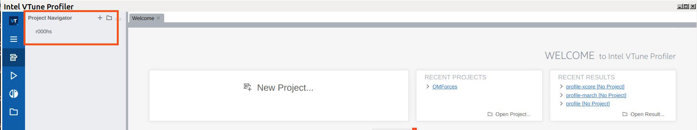

Profiling analysis with VTune
=============================

.. objectives::
    
    - Learn the profiling tool VTune for OpenMP codes

Workflow
^^^^^^^^

- Load your compiler tool: “ml foss”

- Copy/paste the following C code that contains an OpenMP parallel implementation:

.. code-block:: c

    // On cluster Kebnekaise
    // ml foss
    // gcc -O3 -march=native -g -fopenmp -o test.x fibonacci_recursion_omp_tasking.c -lm
    #include <stdio.h>
    #include <stdlib.h>
    #include <omp.h>

    unsigned long long fibbonacci(int n) {
    if(n < 2)
        return n;
    else {
        unsigned long long left, right;     //shared variables
        if (n<40)
        {
            left = fibbonacci(n-1);
            right = fibbonacci(n-2);
            return left+right;
        }
        else {
        #pragma omp task shared(left) firstprivate(n)
        left = fibbonacci(n-1);
        #pragma omp task shared(right) firstprivate(n)
        right = fibbonacci(n-2);

        #pragma omp taskwait //sync tasks
        return left + right;
        }
    }
    }

    int main(int argc, char *argv[]) {
    int n;
    int i;
        
    if(argc > 1) 
        n = atoi(argv[1]);
    else
    {
        printf("Give n : "); scanf("%d", &n);
    } 

    omp_set_dynamic(0);

    #pragma omp parallel shared(n)
    {
        #pragma omp single
        printf("F(%d) = %llu\n",n,fibbonacci(n));
    }
    
    }

- Copy/paste the following batch script *job_vtune.sh* for sending the jobs to the Kebnekaise's batch queue:

.. code-block:: console

    #!/bin/bash
    #SBATCH -A hpc2n202X-XYZ
    #SBATCH -N 1
    #SBATCH -c 10
    #SBATCH --time=00:10:00
    #SBATCH --mail-type=END
    #SBATCH -C skylake

    export OMP_NUM_THREADS=10

    # Load VTUNE
    ml VTune/2021.6.0
    # Load foss
    ml foss

    vtune -collect hotspots -app-working-dir /path-to-your-folder  --app-working-dir=/path-to-your-folder -- /path-to-your-folder/executable list-of-arguments

- Compile your code 

.. code-block:: console

    gcc -O3 -march=native -g -fopenmp-o test.x fibonacci_recursion_omp_tasking.c -lm

- Fix the paths to the directory where you obtained the executable *test.x* in the *job_vtune.sh* script. 

- Also correct the projectID. Then, submitthe job with **sbatch job_vtune.sh**.

- In this script, the number of threads is set to 10 (it takes ~ 2min.) for the Fibonacci number 56.

- Once the job finishes. Load the Vtune module on the terminal: “ml VTune/2021.6.0” and load the gui: 
  *vtune-gui*. Then, load the “r*hs” project:

----

- If you don't see a project, go to “Open Result” and choose the r*hs project and then the “*.vtune” file.
`Intel's tutorial: <https://cdrdv2-public.intel.com/671480/vtune-tutorial-linux-finding-hotspots.pdf>`__

- You can then see the different types of results for this “hotspots” analysis:

.. figure:: img/vtune2.png
    :align: center
    :scale: 70%

----

.. figure:: img/vtune3.png
    :align: center
    :scale: 70%

----