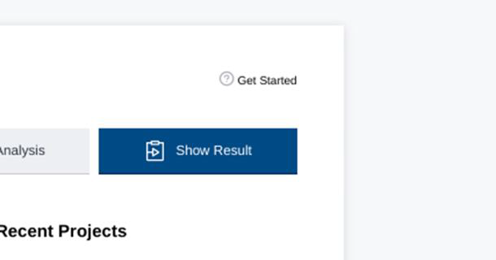

Profiling analysis with VTune and Advisor
=========================================

.. objectives::
    
    - Learn the profiling tool VTune for OpenMP codes

VTune Workflow
^^^^^^^^^^^^^^

- Load your compiler tool: ``ml foss``

- Copy/paste the following C code that contains an OpenMP parallel implementation (at this point you are not
expected to understand the OpenMP directives):

.. code-block:: c

    // On cluster Kebnekaise
    // ml foss
    // gcc -O3 -march=native -g -fopenmp -o test.x fibonacci_recursion_omp_tasking.c -lm
    #include <stdio.h>
    #include <stdlib.h>
    #include <omp.h>

    unsigned long long fibbonacci(int n) {
    if(n < 2)
        return n;
    else {
        unsigned long long left, right;     //shared variables
        if (n<40)
        {
            left = fibbonacci(n-1);
            right = fibbonacci(n-2);
            return left+right;
        }
        else {
        #pragma omp task shared(left) firstprivate(n)
        left = fibbonacci(n-1);
        #pragma omp task shared(right) firstprivate(n)
        right = fibbonacci(n-2);

        #pragma omp taskwait //sync tasks
        return left + right;
        }
    }
    }

    int main(int argc, char *argv[]) {
    int n;
    int i;
        
    if(argc > 1) 
        n = atoi(argv[1]);
    else
    {
        printf("Give n : "); scanf("%d", &n);
    } 

    omp_set_dynamic(0);

    #pragma omp parallel shared(n)
    {
        #pragma omp single
        printf("F(%d) = %llu\n",n,fibbonacci(n));
    }
    
    }

- Copy/paste the following batch script *job_vtune.sh* for sending the jobs to the Kebnekaise's batch queue:

.. code-block:: console

    #!/bin/bash
    #SBATCH -A hpc2n202X-XYZ
    #SBATCH -N 1
    #SBATCH -c 10
    #SBATCH --time=00:10:00
    #SBATCH --mail-type=END
    #SBATCH -C skylake

    export OMP_NUM_THREADS=10

    # Load VTUNE
    ml VTune/2021.6.0
    # Load foss
    ml foss

    vtune -collect hotspots -app-working-dir /path-to-your-folder  --app-working-dir=/path-to-your-folder -- /path-to-your-folder/executable list-of-arguments

- Compile your code 

.. code-block:: console

    gcc -O3 -march=native -g -fopenmp-o test.x fibonacci_recursion_omp_tasking.c -lm

- Fix the paths to the directory where you obtained the executable *test.x* in the *job_vtune.sh* script. 

- Also correct the projectID. Then, submitthe job with **sbatch job_vtune.sh**.

- In this script, the number of threads is set to 10 (it takes ~ 2min.) for the Fibonacci number 56.

- Once the job finishes. Load the Vtune module on the terminal: ``ml VTune/2021.6.0`` and load the gui: 
  *vtune-gui*. Then, load the ``r*hs`` project:

.. figure:: img/vtune1.png
    :align: center
    :scale: 50%

----

- If you don't see a project, go to *Open Result* and choose the ``r*hs`` project and then the ``*.vtune`` file.
`Intel's tutorial: <https://cdrdv2-public.intel.com/671480/vtune-tutorial-linux-finding-hotspots.pdf>`__

- You can then see the different types of results for this *hotspots* analysis:

.. figure:: img/vtune2.png
    :align: center
    :scale: 50%

----

.. figure:: img/vtune3.png
    :align: center
    :scale: 50%

----

Advisor Workflow
^^^^^^^^^^^^^^^^

**Step 1: Compile Your Code**

1. Load your compiler tool::

    ml foss

2. Compile your code::

.. code-block:: c

    // On cluster Kebnekaise
    // ml foss
    // gcc -O3 -march=native -g -o test.x fibonacci_recursion.c -lm
    #include <stdio.h>
    #include <stdlib.h>

    unsigned long long fibbonacci(int n) {
    if(n == 0){
        return 0;
    } else if(n == 1) {
        return 1;
    } else {
        return (fibbonacci(n-1) + fibbonacci(n-2));
    }
    }

    int main(int argc, char *argv[]) {
    int n;
    int i;
        
    if(argc > 1) 
        n = atoi(argv[1]);
    else
    {
        printf("Give n : "); scanf("%d", &n);
    } 

    printf("%llu ",fibbonacci(n));            
    }

    gcc -O3 -march=native -g -o test.x fibonacci_recursion.c -lm

3. Fix the paths to the directory where you obtained the executable ``test.x`` in the ``job_advisor.sh`` script. Also correct the project ID.

4. Submit the job::

.. code-block:: console

    #!/bin/bash
    #SBATCH -A hpc2n202X-XYZ
    #SBATCH -c 1
    #SBATCH --time=00:10:00
    #SBATCH --mail-type=END
    #SBATCH -C skylake

    # Load Intel Advisor tool
    ml Advisor/2023.2.0
    # Load foss
    ml foss

    advisor --collect=roofline --project-dir=./advi_results -- ./executable list-of-arguments    

with the standard command: ``sbatch job_advisor.sh``

5. Note: This script for the Fibonacci number 50 takes approximately 6 minutes.

----

**Step 2: View Results with Advisor GUI**

Once the job finishes:

1. Load the Advisor module on the terminal::

    ml Advisor/2023.2.0

2. Launch the GUI::

    advisor-gui

3. Go to **Open Project**

.. figure:: img/advisor1.png
    :align: center
    :scale: 70%

----

4. Find the ``advi_results`` folder

.. figure:: img/advisor2.png
    :align: center
    :scale: 70%

----

5. Choose the ``advi_results.advixeproj`` file

.. figure:: img/advisor3.png
    :align: center
    :scale: 70%

----

6. Click **Show Results**

----

Measuring Code Performance
^^^^^^^^^^^^^^^^^^^^^^^^^^

*Performance Metrics Formula*

**Floating Point Operations per second (FLOPS):**

.. math::

    \text{FLOPS} = \frac{\text{Nr.FLOP}}{1\text{sec}} = \frac{\text{Nr.FLOP}}{\text{Byte}} \times \frac{\text{Byte}}{\text{sec}}

.. math::

    = \text{Arithmetic Intensity (AI)} \times \text{Bandwidth (BW)}

Roofline Model
--------------

.. figure:: img/advisor5.png
    :align: center
    :scale: 70%

----

The roofline model visualizes performance bottlenecks:

- **X-axis:** Log(AI) - Arithmetic Intensity
- **Y-axis:** Log(FLOPS) - Floating Point Operations per Second
- **Diagonal line:** Represents memory bandwidth constraint
- **Horizontal line:** Represents peak FLOPS (compute capability)

**Performance Regions:**

- **Memory Bound:** Performance limited by bandwidth (below the roofline intersection)
- **Compute Bound:** Performance limited by computation capability (at the roofline ceiling)

More details: https://www.telesens.co/2018/07/26/understanding-roofline-charts/

Understanding Roofline Analysis Results
^^^^^^^^^^^^^^^^^^^^^^^^^^^^^^^^^^^^^^^

The Roofline analysis provides insights into code performance:

*Code Analytics Section*

.. figure:: img/advisor6.png
    :align: center
    :scale: 30%

----

In the **Code Analytics** view, you can see:

- **GFLOPS** = Giga floating point operations per second
- **GINTOPS** = Giga integer operations per second

These metrics show the number of operations per second (floating point or integers) for expensive functions in your code.

Key Metrics Displayed
---------------------

- **Performance:** Operations per second for each function
- **Arithmetic Intensity:** Ratio of compute operations to memory access
- **Elapsed Time:** Time spent in each function
- **Top Functions:** Most computationally expensive functions

The visualization helps identify:

- Whether your code is memory-bound or compute-bound
- Optimization opportunities
- Performance bottlenecks in specific functions

Summary
^^^^^^^

Intel Advisor's Roofline analysis helps you:

1. Understand performance characteristics of your code
2. Identify optimization opportunities
3. Determine if your code is limited by memory bandwidth or compute capability
4. Focus optimization efforts on the most impactful areas
