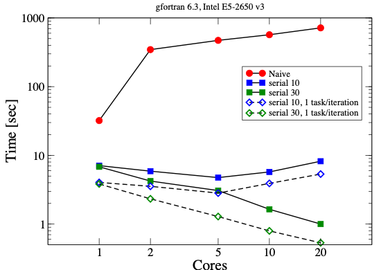
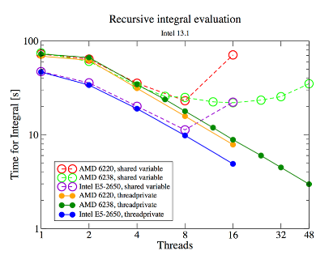

The Task Directive
==================

.. objectives::

 - Learn the basic terminology.
 - Learn about the :code:`task` construct.
 - Learn more about data sharing rules.
 - Learn how to construct a task graph in a three-based manner.
 - Learn how to construct a task graph in a centralised manner.
 - Learn how to wait tasks to complete their execution.

Beyond Regular Loops

Regular vs. Irregular Structures
^^^^^^^^^^^^^^^^^^^^^^^^^^^^^^^^

**So far we've discussed regular structures:**

- Loops with known start and end
- Fortran array constructs

**Many problems have irregular structures:**

- Recursive algorithms
- Linked lists
- Loops with unknown end (e.g., ``while`` loops)
- Divide and conquer algorithms
- And more...

.. note::
   Depending on the details, irregular structures might still be parallelizable using tasks.

The Task Construct
^^^^^^^^^^^^^^^^^^

The task construct provides a flexible way to express parallelism for irregular problems.

*Key Concept*

Tasks allow you to create units of work that can be executed by any thread in the team, now or later.

*The Task Directive in Fortran*

Syntax

.. code-block:: fortran

    !$omp task [clauses]
        code body
    !$omp end task

*What It Does*

Creates an "explicit task" from:

- Code body
- Data environment at that point
- Place inside a parallel region

*Execution*

The task may execute:

- **When:** Now or later
- **By whom:** Encountering thread or other thread

The thread that encounters the :code:`task` construct creates an explicit task from the structured block.
The encountering thread 

 - may execute the task **immediately** or 
 - **defer its execution** to one of the other threads in the team.
 
A task is always **bound to the innermost parallel region**.
If a task construct is encountered outside a parallel region, then the structured block is executed immediately by the encountering thread.

The :code:`task` construct accepts a set of clauses:

.. code-block:: c
    :emphasize-lines: 1,4,6,7,8

    if([ task :] scalar-expression) 
    final(scalar-expression) 
    untied 
    default(shared | none) 
    mergeable 
    private(list) 
    firstprivate(list) 
    shared(list) 
    in_reduction(reduction-identifier : list) 
    depend([depend-modifier,] dependence-type : locator-list) 
    priority(priority-value) 
    allocate([allocator :] list) 
    affinity([aff-modifier :] locator-list) 
    detach(event-handle)

We can already recognise some of the clauses.
For example, the :code:`if` clause can be used to enable/disable the creation of the corresponding task, and the :code:`default`, :code:`private`, :code:`firstprivate`, and :code:`shared` clauses are used to control the data sharing rules.
It should be noted that some of these clauses behave slightly differently when compared to the traditional OpenMP constructs.

Let us return to the earlier "Hello world" program:
    
.. code-block:: c
    :linenos:
    :emphasize-lines: 4,6

    #include <stdio.h>

    int main() {
        #pragma omp parallel
        {
            #pragma omp task
            printf("Hello world!\n");
        }
        return 0;
    }

Note that the :code:`task` pragma is **inside a parallel construct**.
Each thread in the team 

 - encounters the task construct, 
 - creates the corresponding task and 
 - either executes the task immediately or defer its execution to one of the other threads in the team:
 
.. figure:: img/task.png

Therefore, the number of tasks, and lines printed, are the same as the number of threads in the team:
    
.. code-block:: bash
    :emphasize-lines: 3-6

    $ gcc -o my_program my_program.c -Wall -fopenmp
    $ ./my_program 
    Hello world!
    Hello world!
    ...
    Hello world!
    

*The Task Directive in C*

Syntax

.. code-block:: c

    #pragma omp task [clauses]
    {
        code body
    }

*What It Does*

Creates an "explicit task" from:

- Code body
- Data environment at that point
- Place inside a parallel region

*Execution*

The task may execute:

- **When:** Now or later
- **By whom:** Encountering thread or other thread

Allowed Data Sharing Attributes for Tasks
^^^^^^^^^^^^^^^^^^^^^^^^^^^^^^^^^^^^^^^^^

*Available Attributes*

**private:**

- Data is private to the task

**firstprivate:**

- Data is private to the task
- Data initialized when task directive is encountered

**shared:**

- Data is shared
- **Only way to return a result from a task!**

**default:**

- **Fortran:** ``shared | private | firstprivate | none``
- **C:** ``shared | none``

Data Sharing Without a default Clause
^^^^^^^^^^^^^^^^^^^^^^^^^^^^^^^^^^^^^

When no ``default`` is declared on a task directive:

*Default Rules*

**If variable is shared by all implicit tasks in the current team:**

Variable is: ``shared``

**Otherwise:**

Variable is: ``firstprivate``

*Recommendation*

.. important::
   Use ``default(none)`` to be explicit about data sharing!

*Example: Task Execution Flow*

Consider this code:

.. code-block:: fortran

    code block 1
    !$omp task
        code block 2
    !$omp end task
    code block 3

*Thread Encountering This Code*

1. **Executes** "code block 1"
2. **Creates a task** for "code block 2"
3. **May:**
   
   - Execute the task for "code block 2"
   - Pick up another task
   - Continue with "code block 3"

4. **At some point:** Has to execute code block 3

*No Control Over*

.. warning::
   - Who executes code block 2
   - When code block 2 is finished

.. challenge::

    Use two tasks where each prints out *Hello* and *World* strings. Use 4 threads. 

.. solution::

    .. code-block:: c
        :linenos:

        // On cluster Kebnekaise
        // ml foss
        // export OMP_NUM_THREADS=1 
        // gcc -O3 -march=native -fopenmp -o test.x 12a-task-openmp.c -lm 
        #include <stdio.h>
        #include <omp.h>

        int main() {

            #pragma omp parallel num_threads(4)
            {

                #pragma omp task
                {printf("Hello\n");}

                #pragma omp task
                {printf("World\n");}

            }

            return 0;
        }

Let us consider the data sharing rules with the following example:

.. code-block:: c
    :linenos:
    :emphasize-lines: 5,7

    #include <stdio.h>
    
    int main() {
        int number = 1;
        #pragma omp parallel
        {
            #pragma omp task
            {
                printf("I think the number is %d.\n", number);
                number++;
            }
        }
        return 0;
    }
    
The output of the program is not that surprising:

.. code-block::
    :emphasize-lines: 3-6

    $ gcc -o my_program my_program.c -Wall -fopenmp
    $ ./my_program 
    I think the number is 1.
    I think the number is 2.
    I think the number is 2.
    I think the number is 3.
    ...

That is, variables declared outside the parallel construct are still :code:`shared` by default.
This is consistent with the three basic data sharing rules.

If we move the variable :code:`number` inside the parallel construct, then the variable becomes :code:`firstprivate` by default:

.. code-block:: c
    :linenos:
    :emphasize-lines: 6

    #include <stdio.h>
    
    int main() {
        #pragma omp parallel
        {
            int number = 1;
            #pragma omp task
            {
                printf("I think the number is %d.\n", number);
                number++;
            }
        }
        return 0;
    }

.. code-block::
    :emphasize-lines: 3-6

    $ gcc -o my_program my_program.c -Wall -fopenmp
    $ ./my_program 
    I think the number is 1.
    I think the number is 1.
    I think the number is 1.
    I think the number is 1.
    ...

The value of the variable is copied when the task is created.

Single construct
^^^^^^^^^^^^^^^^

In the earlier examples, **each thread in the team created a task**. 
This is sometimes very convenient as the need for new tasks might arise gradually.
However, it is more likely that we want to generate the task graph in a centralized manner, i.e. **only one thread should generate the task**.
This can be accomplished by combining the :code:`parallel` and :code:`single` constructs:

.. code-block:: c
    :linenos:
    :emphasize-lines: 4-5,7

    #include <stdio.h>

    int main() {
        #pragma omp parallel
        #pragma omp single nowait
        {
            #pragma omp task
            printf("Hello world!\n");
        }
        return 0;
    }

The :code:`nowait` clause removes the redundant barrier from the end of the :code:`single` construct. 
    
.. code-block:: bash
    :emphasize-lines: 3

    $ gcc -o my_program my_program.c -Wall -fopenmp
    $ ./my_program 
    Hello world!
    
Note that the binding thread set for a :code:`single` region is the current team.
That is, any tasks in the current team can execute the task.

.. challenge::

    Write a program that creates 10 tasks. 
    Each task should print the thread number of the calling thread.
    
    **Hint:** From the :code:`omp.h` header file:
    
    .. code-block:: c
    
        int omp_get_thread_num (void);
    
.. solution::

    .. code-block:: c
        :linenos:
        
        #include <stdio.h>
        #include <omp.h>

        int main() {
            #pragma omp parallel
            #pragma omp single nowait
            {
                for (int i = 0; i < 10; i++) {
                    #pragma omp task
                    printf("I am thread no. %d.\n", omp_get_thread_num());
                }
            }
            return 0;
        }
        
    .. code-block:: bash
        :emphasize-lines: 3-12
    
        $ gcc -o my_program my_program.c -Wall -fopenmp                       
        $ ./my_program                                 
        I am thread no. 5.
        I am thread no. 13.
        I am thread no. 6.
        I am thread no. 8.
        I am thread no. 4.
        I am thread no. 7.
        I am thread no. 15.
        I am thread no. 12.
        I am thread no. 0.
        I am thread no. 9.

.. challenge::

    Inspect and run the following code to see the behavior of shared, private, and first private variables in the context of tasks.
    Notice that one can use **atomic updates** together with tasks.

    .. code-block:: c
        :linenos:

        // On cluster Kebnekaise
        // ml foss
        // export OMP_NUM_THREADS=1 
        // gcc -O3 -march=native -fopenmp -o test.x 13a-sharedprivate-task-openmp.c -lm 
        #include <stdio.h>
        #include <omp.h>

        void process_task(int id, int *shared_data) {
            printf("Task %d: shared_data = %d\n", id, *shared_data);
        }

        int main() {
            int shared_data = 100; // variable that is shared across tasks
            int private_data = 200; // variable is private to each task

            #pragma omp parallel
            {
                #pragma omp single
                {
                    for (int i = 0; i < 4; i++) {
                        int firstprivate_data = i * 10; // firstprivate variable: unique for each task but initialized with i * 10

                        #pragma omp task shared(shared_data) private(private_data) firstprivate(firstprivate_data)
                        {
                            // here we modify the private_data variable, which is unique to each task
                            private_data = i * 100;
                            printf("Task %d: private_data = %d, firstprivate_data = %d\n", i, private_data, firstprivate_data);
                            
                            // Calling a function with shared data
                            process_task(i, &shared_data);

                            // Use an atomic op. for shared_data  or critical?
                            #pragma omp atomic
                            shared_data += 1;
                        }
                    }
                }
            }

            printf("Final value of shared_data: %d\n", shared_data);

            return 0;
        }

.. challenge::

    Inspect and run the following code to see the behavior of first private variables in the context of tasks.

    .. code-block:: c
        :linenos:

        // On cluster Kebnekaise
        // ml foss
        // export OMP_NUM_THREADS=1 
        // gcc -O3 -march=native -fopenmp -o test.x 13b-firstprivate-task-openmp.c -lm 
        #include <stdio.h>
        #include <omp.h>

        void task_example() {
            int n = 5; // a shared variable with an initial value

            #pragma omp parallel
            {
                #pragma omp single
                {
                    for (int i = 0; i < 5; i++) {
                        #pragma omp task private(n) firstprivate(n)
                        {
                            // n is private to each task, initialized with its value at task creation
                            n += i; // Modify n for this task
                            printf("Task %d: n = %d\n", i, n);
                        }
                    }
                }
            }
        }

        int main() {
            task_example();
            return 0;
        }

.. challenge::

    The following function takes an integer as input, and writes the thread number that handles
    the execution of the function. Use ``tasks`` to parallelize a *for* loop where each task 
    executes this function:

    .. code-block:: c
        :linenos:

        void process_element(int i) {
            // do some work for each element by printing out the thread ID excuting this work
            printf("Processing element %d in thread %d\n", i, omp_get_thread_num());
        }

.. solution::

    .. code-block:: c
        :linenos:

        // On cluster Kebnekaise
        // ml foss
        // export OMP_NUM_THREADS=1 
        // gcc -O3 -march=native -fopenmp -o test.x 12c-task-openmp.c -lm 
        #include <stdio.h>
        #include <omp.h>

        void process_element(int i) {
            // do some work for each element by printing out the thread ID excuting this work
            printf("Processing element %d in thread %d\n", i, omp_get_thread_num());
        }

        int main() {
            int n = 10;

            #pragma omp parallel
            {
                // single directive ensures that only one thread generates tasks
                #pragma omp single
                {
                    for (int i = 0; i < n; i++) {
                        // Create a new task for each array element
                        #pragma omp task
                        {
                        process_element(i);
                        }
                    }
                printf("Generating tasks \n");
                }
            }

            return 0;
        }

Allowing Suspension of Current Task
^^^^^^^^^^^^^^^^^^^^^^^^^^^^^^^^^^^

*taskyield Construct*

At a ``taskyield`` construct, the current task can be suspended to execute a different task.

Syntax

**Fortran:**

.. code-block:: fortran

    !$omp taskyield

**C:**

.. code-block:: c

    #pragma omp taskyield

*Use Case*

Allows the runtime to schedule other tasks while waiting for resources or dependencies.

.. challenge::

    Inspect and run the following code to see the behavior of *taskyield* in the context of tasks.

    .. code-block:: c
        :linenos:

        // On cluster Kebnekaise
        // ml foss
        // export OMP_NUM_THREADS=1 
        // gcc -O3 -march=native -fopenmp -o test.x 17-taskyield-openmp.c -lm 
        // ml GCCcore/12.3.0 Clang/16.0.6
        // clang -O3 -fopenmp -o test.x 17-taskyield-openmp.c
        #include <omp.h>
        #include <stdio.h>
        #include <unistd.h>
        #include <stdlib.h>

        void something_useful(int id,int random_time) {
            sleep(random_time); // Simulate work
            printf("Task %d: did something useful on thread %d\n", id, omp_get_thread_num());
        }

        void something_critical(int id,int random_time) {
            sleep(random_time); // Simulate longer work
            printf("Task %d: did something critical on thread %d\n", id, omp_get_thread_num());
        }

        void foo(omp_lock_t *lock, int n) {
            srand(1999); // seed the random number generator
            int min = 1, max = 10;
            for (int i = 0; i < n; i++) {
                int random_time1 = rand() % (max - min + 1) + min;
                int random_time2 = rand() % (max - min + 1) + min;
                #pragma omp task
                {
                    something_useful(i,random_time1);

                    // Use taskyield to allow other tasks to execute while waiting
                    while (!omp_test_lock(lock)) {
                        #pragma omp taskyield
                        sleep(5);
                    }

                    something_critical(i,random_time2);
                    omp_unset_lock(lock);
                }
            }
        }

        int main() {
            int n = 10; // Number of tasks
            omp_lock_t lock;
            omp_init_lock(&lock);

            #pragma omp parallel
            {
                #pragma omp single
                foo(&lock, n);
            }

            omp_destroy_lock(&lock);
            return 0;
        }

Child tasks and taskwait construct
^^^^^^^^^^^^^^^^^^^^^^^^^^^^^^^^^^

A task can create new **child tasks**:

.. code-block:: c
    :linenos:
    :emphasize-lines: 7-8
    
    #include <stdio.h>
    
    int main() {
        #pragma omp parallel
        #pragma omp single
        {
            #pragma omp task
            {
                #pragma omp task
                printf("Hello.\n");

                printf("Hi.\n"); 
            }

            printf("Hej.\n");
        }

        printf("Goodbye.\n"); 

        return 0;
    }

.. code-block:: bash
    :emphasize-lines: 4-5,9-10

    $ gcc -o my_program my_program.c -Wall -fopenmp
    $ ./my_program 
    Hej
    Hi.
    Hello.
    Goodbye.
    $ ./my_program 
    Hej.
    Hello.
    Hi.
    Goodbye.

Note that child tasks are executed separately from the generating tasks. 
In particular, it is possible that a child task gets executed after the generating task has finished.
We can use the :code:`taskwait` construct to **wait on the completion of child tasks** of the generating task:

.. code-block:: c

    #pragma omp taskwait [clause[ [,] clause] ... ] new-line

This allows us to enforce an execution order:

.. code-block:: c
    :linenos:
    :emphasize-lines: 12
    
    #include <stdio.h>

    int main() {
        #pragma omp parallel
        #pragma omp single
        {
            #pragma omp task
            {
                #pragma omp task
                printf("Hello.\n");

                #pragma omp taskwait

                printf("Hi.\n"); 
            }

            printf("Hej.\n");
        }

        printf("Goodbye.\n"); 

        return 0;
    }
    
.. code-block:: bash
    :emphasize-lines: 4-5
    
    $ gcc -o my_program my_program.c -Wall -fopenmp
    $ ./my_program 
    Hej.
    Hello.
    Hi.
    Goodbye.

Controlling When Tasks Finish
^^^^^^^^^^^^^^^^^^^^^^^^^^^^^

*taskwait Directive*

.. code-block:: fortran

    !$omp taskwait

**Purpose:**

- Ensures child tasks have completed
- **Does not** consider grandchildren, etc.

*barrier Directive*

.. code-block:: fortran

    !$omp barrier

**Purpose:**

- Ensures **all tasks** in the innermost parallel region have finished

.. note::
   Instead of waiting, a thread can execute tasks generated elsewhere.

All threads in the team must reach the barrier and **complete all explicit tasks** bound to the parallel region before they are allowed to continue execution beyond the barrier:

.. code-block:: c
    :linenos:
    :emphasize-lines: 9

    #include <stdio.h>

    int main() {
        #pragma omp parallel
        {
            #pragma omp task
            printf("Hello.\n");

            #pragma omp barrier

            #pragma omp task
            printf("Goodbye.\n");
        }

        return 0;
    }
    
.. code-block:: bash

    $ gcc -o my_program my_program.c -Wall -fopenmp
    $ ./my_program 
    Hello.
    Hello.
    ...
    Hello.
    Goodbye.
    Goodbye.
    Goodbye.
    ...

.. challenge::

    Inspect and run the following code to see the behavior of *taskwait* and *barrier* in the context of tasks.

    .. code-block:: c
        :linenos:

        // On cluster Kebnekaise
        // ml foss
        // export OMP_NUM_THREADS=1 
        // gcc -O3 -march=native -fopenmp -o test.x 19-taskwait-barrier-openmp.c -lm 
        // ml GCCcore/12.3.0 Clang/16.0.6
        // clang -O3 -fopenmp -o test.x 19-taskwait-barrier-openmp.c
        #include <stdio.h>
        #include <omp.h>
        #include <unistd.h>

        void process_task(int task_id) {
            printf("task %d started by thread %d\n", task_id, omp_get_thread_num());
            #pragma omp taskyield
            // do some work
            sleep(3);
            printf("task %d completed by thread %d\n", task_id, omp_get_thread_num());
        }

        int main() {
            #pragma omp parallel
            {
                #pragma omp single
                {
                    // create some initial tasks set of tasks
                    for (int i = 0; i < 3; i++) {
                        #pragma omp task
                        process_task(i);
                    }

                    // wait for all tasks created up to now
                    #pragma omp taskwait
                    printf("All tasks at this level completed, but children,grandchildren tasks may still be running.\n");

                    // Second set of tasks
                    for (int i = 3; i < 6; i++) {
                        #pragma omp task
                        process_task(i);
                    }
                }
                // A Barrier synchronizes all threads in the parallel region
                #pragma omp barrier
                printf("All threads have reached the barrier.\n");
            }

            return 0;
        }

taskgroup: Controlling Descendant Tasks (OpenMP 4.0)
^^^^^^^^^^^^^^^^^^^^^^^^^^^^^^^^^^^^^^^^^^^^^^^^^^^^

A ``taskgroup`` construct defines a region with an implied task scheduling point at the end.

Current task is suspended until **all descendant tasks** (including grandchildren, etc.) have completed.

*Fortran Syntax*

.. code-block:: fortran

    !$omp taskgroup
    do i = 1, n
        !$omp task ...
            call processing(...)
        !$omp end task
    end do
    !$omp end taskgroup  ! Waits for all tasks, including
                          ! tasks generated in processing

*C Syntax*

.. code-block:: c

    #pragma omp taskgroup
    {
        for (int i = 0; i < n; i++)
        {
            #pragma omp task ...
            {
                processing(...);
            }
        }
    }  // Waits for all tasks, including
       // tasks generated in processing

Controlling Task Creation
^^^^^^^^^^^^^^^^^^^^^^^^^

*The Overhead Problem*

Creating a task encounters significant overhead:

- Requires significant work inside the task to pay off
- Too many small tasks can hurt performance

*Solution: if Clause*

Use the ``if`` clause to control task creation:

.. code-block:: fortran

    !$OMP task if(level .lt. 10) ...
        ...
    !$OMP end task

If the expression evaluates to ``.false.``:

- Encountering thread executes code body directly (included task)
- No task creation overhead

.. challenge::

    Inspect and run the following code to see the behavior of *if* clause in the context of tasks.

    .. code-block:: c
        :linenos:

        // On cluster Kebnekaise
        // ml foss
        // export OMP_NUM_THREADS=1 
        // gcc -O3 -march=native -fopenmp -o test.x 15-ifclause-task-openmp.c -lm 
        #include <stdio.h>
        #include <omp.h>

        void process_task(int task_id) {
            printf("Processing iteration task %d in thread %d\n", task_id, omp_get_thread_num());
        }

        int main() {
            int n = 5; // Threshold for deciding if the task is executed synchronously or asynchrously

            #pragma omp parallel
            {
                #pragma omp single
                {
                    for (int i = 0; i < 10; i++) {
                        // the task creation will depend on the value of "i" and the clause with "if" condition
                        #pragma omp task if(i > n) // Tasks with i > n are deferred; others run in the current thread
                        {
                        process_task(i);

                        // childrens behave as regular tasks (can be deferred)
                        #pragma omp task
                        {
                            printf("Nested task for %d in thread %d\n", i, omp_get_thread_num());
                        }
                        }
                    }
                }
            }

            return 0;
        }

Final Tasks
^^^^^^^^^^^

A task can carry a ``final`` clause to control task generation in descendants.

*Syntax*

.. code-block:: fortran

    !$OMP task final(level .gt. 30) ...
        ...
    !$OMP end task

If the expression evaluates to ``.true.``:

- All encountered tasks within this task will be:
  
  - **Included** (executed immediately by encountering thread)
  - **Final** (they also cannot generate new tasks)

*Use Case*

Prevents excessive task creation in deep recursion by serializing once a certain depth is reached.

.. challenge::

    Inspect and run the following code to see the behavior of *final* clause in the context of tasks.

    .. code-block:: c
        :linenos:

        // On cluster Kebnekaise
        // ml foss
        // export OMP_NUM_THREADS=1 
        // gcc -O3 -march=native -fopenmp -o test.x 16-finalclause-task-openmp.c -lm 
        #include <stdio.h>
        #include <omp.h>

        void process_task(int task_id) {
            printf("Processing iteration task %d in thread %d\n", task_id, omp_get_thread_num());
        }

        int main() {
            int n = 5; // Threshold for the final clause

            #pragma omp parallel
            {
                #pragma omp single
                {
                    for (int i = 0; i < 10; i++) {
                        // when i <= n, the task and its child tasks are final and included
                        // when i > n, task is final and child tasks are regular tasks
                        #pragma omp task final(i <= n)
                        {
                            process_task(i);

                            #pragma omp task 
                            {
                                printf("Nested task for %d in thread %d\n", i, omp_get_thread_num());
                                #pragma omp task 
                                {
                                printf("Subnested task for %d in thread %d\n", i, omp_get_thread_num());
                                }
                            }
                        }
                    }
                }
            }
            return 0;
        }

Mergeable Tasks
^^^^^^^^^^^^^^^

A task can be declared as ``mergeable`` for optimization.

*Syntax*

.. code-block:: fortran

    !$omp task mergeable ...

.. code-block:: c

    #pragma omp task mergeable ...

For an undeferred or included task, the implementation may:

- Use the data environment of the generating task (including internal control variables)
- Optimize by merging task execution

*Use Case*

Often used with ``final`` clause for optimization at deep recursion levels.

.. challenge::

    Inspect and run the following code to see the behavior of *mergeable* clause in the context of tasks.

    .. code-block:: c
        :linenos:

        // On cluster Kebnekaise
        // ml foss
        // export OMP_NUM_THREADS=1 
        // gcc -O3 -march=native -fopenmp -o test.x 18b-mergeable-task-openmp.c -lm 
        // ml GCCcore/12.3.0 Clang/16.0.6
        // clang -O3 -fopenmp -o test.x 18b-mergeable-task-openmp.c
        #include <omp.h>
        #include <stdio.h>

        void process_task(int task_id) {
            printf("Processing task %d on thread %d\n", task_id, omp_get_thread_num());
        }

        int main() {
            int n = 10; // nr. of iterations
            
            #pragma omp parallel
            {
                #pragma omp single
                {
                    for (int i = 0; i < n; i++) {
                        // tasks with the mergeable clause
                        #pragma omp task mergeable
                        {
                            process_task(i);
                        }
                    }
                }
            }
            
            return 0;
        }

Task Scheduling Points
^^^^^^^^^^^^^^^^^^^^^^

Threads may switch to a different task at a **task scheduling point**.

*Task Scheduling Points Are*

1. Immediately after generation of an explicit task
2. After point of completion of a task
3. At ``taskwait`` or ``taskyield``
4. At ``barrier`` (explicit or implicit)
5. At the end of ``taskgroup``

**Untied Tasks (Advanced)**

.. warning::
   Untied tasks (not covered in this course) may switch at any point.
   
   - Be careful with ``critical`` regions and locks
   - Example: task may switch out of critical region → **deadlock!**

*Case Study 1: Recursive Fibonacci*

Fibonacci Numbers Mathematical series:

.. math::

   F_0 &= 0 \\
   F_1 &= 1 \\
   F_n &= F_{n-1} + F_{n-2}

First numbers in series: 0, 1, 1, 2, 3, 5, 8, 13, 21, 34, ...

.. note::
   Recursive implementation: not efficient for computation, but good for demonstrating task parallelism!

*Recursion Tree*

.. code-block:: text

                      n
                   /     \
                n-1       n-2
               /   \     /   \
            n-2   n-3  n-3  n-4
           / \    / \  / \  / \
         ...  ... ... ... ... ...

.. tabs::

    .. tab:: C 

        *Serial Fibonacci Implementation (C)*

        .. code-block:: c

            unsigned long long recursive_fib(int in) {
                unsigned long long fibnum, sub1, sub2;
                
                if (in > 1) {
                    sub1 = recursive_fib(in - 1);
                    sub2 = recursive_fib(in - 2);
                    fibnum = sub1 + sub2;
                } else {
                    fibnum = in;
                }
                return fibnum;
            }

        *Parallel Version: Attempt 1 (C)*

        Adding One Task

        .. code-block:: c

            unsigned long long recursive_fib(int in) {
                unsigned long long fibnum, sub1, sub2;
                
                if (in > 1) {
                    #pragma omp task shared(sub1) firstprivate(in)
                    {
                        sub1 = recursive_fib(in - 1);
                    }
                    sub2 = recursive_fib(in - 2);
                    fibnum = sub1 + sub2;
                } else {
                    fibnum = in;
                }
                return fibnum;
            }

        *Data Sharing*

        - ``sub1`` is ``shared`` - declared inside function, must share to return result
        - ``in`` is ``firstprivate`` - initialized at task creation

        *Parallel Version: Attempt 2 (C)*

        Adding Second Task

        .. code-block:: c

            unsigned long long recursive_fib(int in) {
                unsigned long long fibnum, sub1, sub2;
                
                if (in > 1) {
                    #pragma omp task shared(sub1) firstprivate(in)
                    {
                        sub1 = recursive_fib(in - 1);
                    }
                    #pragma omp task shared(sub2) firstprivate(in)
                    {
                        sub2 = recursive_fib(in - 2);
                    }
                    fibnum = sub1 + sub2;
                } else {
                    fibnum = in;
                }
                return fibnum;
            }

        .. danger::
        **Problem:** Need to have ``sub1`` and ``sub2`` ready before computing ``fibnum``!

        *Parallel Version: Final Solution (C)*

        Adding taskwait

        .. code-block:: c

            unsigned long long recursive_fib(int in) {
                unsigned long long fibnum, sub1, sub2;
                
                if (in > 1) {
                    #pragma omp task shared(sub1) firstprivate(in)
                    {
                        sub1 = recursive_fib(in - 1);
                    }
                    #pragma omp task shared(sub2) firstprivate(in)
                    {
                        sub2 = recursive_fib(in - 2);
                    }
                    #pragma omp taskwait
                    fibnum = sub1 + sub2;
                } else {
                    fibnum = in;
                }
                return fibnum;
            }

        *Solution*

        - ``taskwait`` waits for the 2 tasks above
        - Recursion takes care of grandchildren automatically

        *Calling the Parallel Fibonacci*

        Original Serial Code

        .. code-block:: c

            #include <stdio.h>
            #include <stdlib.h>
            
            int main(int argc, char *argv[]) {
                unsigned long long fibres;
                int input;
                
                printf("Enter input: ");
                scanf("%d", &input);
                fibres = recursive_fib(input);
                printf("Fibonacci number %d is: %llu\n", input, fibres);
                
                return 0;
            }

        *Attempt: Starting Parallel Region*

        .. code-block:: c

            #include <stdio.h>
            #include <stdlib.h>
            #include <omp.h>
            
            int main(int argc, char *argv[]) {
                unsigned long long fibres;
                int input;
                
                printf("Enter input: ");
                scanf("%d", &input);
                
                #pragma omp parallel shared(input, fibres) default(none)
                {
                    fibres = recursive_fib(input);
                }
                
                printf("Fibonacci number %d is: %llu\n", input, fibres);
                
                return 0;
            }

        .. danger::
        **Problem:** Each thread starts Fibonacci calculation! Multiple redundant computations.

        *Solution: Using single Construct*

        .. code-block:: c

            #include <stdio.h>
            #include <stdlib.h>
            #include <omp.h>
            
            int main(int argc, char *argv[]) {
                unsigned long long fibres;
                int input;
                
                printf("Enter input: ");
                scanf("%d", &input);
                
                #pragma omp parallel shared(input, fibres) default(none)
                {
                    #pragma omp single
                    {
                        fibres = recursive_fib(input);
                    }
                }
                
                printf("Fibonacci number %d is: %llu\n", input, fibres);
                
                return 0;
            }

        .. note::
        ``single`` ensures only one thread starts the recursion, but all threads can help execute tasks.

    .. tab:: Fortran
      

        *Serial Fibonacci Implementation (Fortran)*

        .. code-block:: fortran

            recursive function recursive_fib(in) result(fibnum)
                integer, intent(in) :: in
                integer(lint) :: fibnum, sub1, sub2
                
                if (in .gt. 1) then
                    sub1 = recursive_fib(in - 1)
                    sub2 = recursive_fib(in - 2)
                    fibnum = sub1 + sub2
                else
                    fibnum = in
                endif
            end function recursive_fib

        *Parallel Version: Attempt 1 (Fortran)*

        Adding One Task

        .. code-block:: fortran

            recursive function recursive_fib(in) result(fibnum)
                integer, intent(in) :: in
                integer(lint) :: fibnum, sub1, sub2
                
                if (in .gt. 1) then
                    !$OMP task shared(sub1) firstprivate(in)
                        sub1 = recursive_fib(in - 1)
                    !$OMP end task
                    sub2 = recursive_fib(in - 2)
                    fibnum = sub1 + sub2
                else
                    fibnum = in
                endif
            end function recursive_fib

        *Data Sharing*

        - ``sub1`` is ``shared`` - declared inside function, must share to return result
        - ``in`` is ``firstprivate`` - initialized at task creation

        *Parallel Version: Attempt 2 (Fortran)*

        Adding Second Task

        .. code-block:: fortran

            recursive function recursive_fib(in) result(fibnum)
                integer, intent(in) :: in
                integer(lint) :: fibnum, sub1, sub2
                
                if (in .gt. 1) then
                    !$OMP task shared(sub1) firstprivate(in)
                        sub1 = recursive_fib(in - 1)
                    !$OMP end task
                    !$OMP task shared(sub2) firstprivate(in)
                        sub2 = recursive_fib(in - 2)
                    !$OMP end task
                    fibnum = sub1 + sub2
                else
                    fibnum = in
                endif
            end function recursive_fib

        .. danger::
        **Problem:** Need to have ``sub1`` and ``sub2`` ready before computing ``fibnum``!

        *Parallel Version: Final Solution (Fortran)*

        Adding taskwait

        .. code-block:: fortran

            recursive function recursive_fib(in) result(fibnum)
                integer, intent(in) :: in
                integer(lint) :: fibnum, sub1, sub2
                
                if (in .gt. 1) then
                    !$OMP task shared(sub1) firstprivate(in)
                        sub1 = recursive_fib(in - 1)
                    !$OMP end task
                    !$OMP task shared(sub2) firstprivate(in)
                        sub2 = recursive_fib(in - 2)
                    !$OMP end task
                    !$OMP taskwait
                    fibnum = sub1 + sub2
                else
                    fibnum = in
                endif
            end function recursive_fib

        *Solution*

        - ``taskwait`` waits for the 2 tasks above
        - Recursion takes care of grandchildren automatically

        *Calling the Parallel Fibonacci*

        Original Serial Code

        .. code-block:: fortran

            program fibonacci
                !$ use omp_lib
                integer, parameter :: lint = selected_int_kind(10)
                integer(lint) :: fibres
                integer :: input
                
                read (*,*) input
                fibres = recursive_fib(input)
                print *, "Fibonacci number", input, " is:", fibres
            end program fibonacci

        *Attempt: Starting Parallel Region*

        .. code-block:: fortran

            program fibonacci
                !$ use omp_lib
                integer, parameter :: lint = selected_int_kind(10)
                integer(lint) :: fibres
                integer :: input
                
                read (*,*) input
                !$OMP parallel shared(input, fibres) default(none)
                    fibres = recursive_fib(input)
                !$OMP end parallel
                print *, "Fibonacci number", input, " is:", fibres
            end program fibonacci

        .. danger::
        **Problem:** Each thread starts Fibonacci calculation! Multiple redundant computations.

        *Solution: Using single Construct*

        .. code-block:: fortran

            program fibonacci
                !$ use omp_lib
                integer, parameter :: lint = selected_int_kind(10)
                integer(lint) :: fibres
                integer :: input
                
                read (*,*) input
                !$OMP parallel shared(input, fibres) default(none)
                    !$OMP single
                        fibres = recursive_fib(input)
                    !$OMP end single
                !$OMP end parallel
                print *, "Fibonacci number", input, " is:", fibres
            end program fibonacci

        .. note::
        ``single`` ensures only one thread starts the recursion, but all threads can help execute tasks.

*Performance: Fibonacci Number 40*

Benchmark Setup

**Hardware:** Intel E5-2650 v3
**Test:** Computing Fibonacci(40)
**Compilers:** gfortran 6.3, ifort 17.1

Results Summary

----

*Key Observations*

Both compilers show similar patterns:

- **Naive implementation** (2 tasks per iteration): Poor performance
- **Using if clause** (no tasks for low values): Helps significantly
- **1 task per iteration**: Helps even more
- **Problem:** Too little work per task
- **Solution:** Limit the number of tasks created

*Discussion: Fibonacci Performance*

Key Findings

**Task Overhead:**

- Creating tasks has significant overhead
- Need sufficient work per task to justify overhead

**Optimization Strategies:**

1. **if clause:** Prevents task creation for small problem sizes
2. **Limit task creation:** Only create tasks at higher recursion levels
3. **Balance:** Between parallelism and overhead

Hardware Details

**Test System:**

- 2 sockets per server
- Intel E5-2650 v3
- 10 cores per processor

**Compilers:**

- **gfortran:** Version 6.3 with thread binding
- **Intel ifort:** Version 17.1 with thread binding

*Case Study 2: Self-Refining Recursive Integrator*

Mesh Refinement Concept

Codes employing irregular grids benefit from dynamic grid refinement/coarsening:

**Example: Fluid dynamics**

- Refine grid where eddy develops
- Coarsen when eddy vanishes

*Case Study Application*

Self-refining integrator for 1D function.

Basic Algorithm
^^^^^^^^^^^^^^^

Integration with Adaptive Refinement

1. **Evaluate function** at 5 regularly spaced points in interval
2. **Estimate integral** using two methods:
   
   - Polygon using all 5 points (accurate)
   - Polygon using only 3 points (first, center, last) (coarse)

3. **Check difference** between the two integrals:
   
   - Compare to threshold * interval length

4. **Decision:**
   
   - **If accurate:** Add contribution to accumulator
   - **If not accurate:**
     
     - Split interval into two pieces
     - Run integrator on both pieces (recursion)

*Implementation: Parallel Region*

.. code-block:: fortran

    accumulator = 0.0D0
    
    !$OMP parallel default(none) &
    !$OMP shared(accumulator) &
    !$OMP shared(startv, stopv, unit_err, gen_num)
        !$OMP single
            call rec_eval_shared_update( &
                startv, stopv, unit_err, gen_num)
        !$OMP end single
    !$OMP end parallel

*Key Design Decisions*

**Shared variable accumulator:**

- Declared as module variable
- Used to accumulate results

**single construct:**

- Starts the recursive integrator once
- Implied barrier ensures all tasks are finished

**Recursive subroutine:**

- ``rec_eval_shared_update``

*Implementation: Task Startup*

.. code-block:: fortran

    !$OMP task shared(accumulator) firstprivate(my_start, my_stop) &
    !$OMP default(none) firstprivate(my_gen, u_err) &
    !$OMP if(task_start)
        call rec_eval_shared_update( &
            my_start, 0.5_dpr * (my_start + my_stop), u_err, my_gen)
    !$OMP end task
    
    !$OMP task shared(accumulator) firstprivate(my_start, my_stop) &
    !$OMP default(none) firstprivate(my_gen, u_err) &
    !$OMP if(task_start)
        call rec_eval_shared_update( &
            0.5_dpr * (my_start + my_stop), my_stop, u_err, my_gen)
    !$OMP end task

Recursion Strategy

- Split interval in half
- Create two tasks for sub-intervals
- Each task may recursively subdivide further

*Implementation: Result Accumulation*

Three Approaches

**1. Shared variable with atomic update:**

.. code-block:: fortran

    !$omp atomic update
    accumulator = accumulator + contribution

**2. Threadprivate variables:**

- Thread executing task adds to its threadprivate copy
- After barrier (implied in ``end single``): atomic update of threadprivate data into shared variable

**Remarks:**

.. warning::
   Be careful with threadprivate and task scheduling points!
   
   - Value can be changed after scheduling point
   - threadprivate isn't private to the task

**OpenMP 5.0:**

OpenMP 5.0 has reduction constructs for tasks.

*Test Function*

Mathematical Function

.. math::

   f(x) = \sin^2(10000x) \cdot \sin^4(x)

Properties

- Highly oscillatory (due to sin(10000x) term)
- Requires adaptive refinement
- Samples more densely where function varies rapidly

Sampling Pattern

The integrator samples most densely where the function oscillates most rapidly, demonstrating the effectiveness of adaptive refinement.

*Performance Results: Integrator*

Configuration

- Task started every 5th generation
- Two accumulation strategies tested

----

*Key Findings*

**Atomic updates:**

- Poor results (millions of atomic operations)

**Threadprivate accumulation:**

- Satisfactory results
- Efficient utilization of up to 128 cores

*Compiler Comparison: Integrator*

.. note::
   GCC shows inferior scalability beyond 20 cores compared to Intel compiler.

Task Dependencies (OpenMP 4.0)
^^^^^^^^^^^^^^^^^^^^^^^^^^^^^^

Declare explicit dependencies between tasks to control execution order.

Syntax

**Fortran:**

.. code-block:: fortran

    !$omp task depend(type : list)

**C:**

.. code-block:: c

    #pragma omp task depend(type : list)

*Dependency Types*

**in:**

- Task depends on all previous siblings with ``out`` or ``inout`` dependency on one or more list items

**out, inout:**

- Task depends on all previous siblings with ``in``, ``out``, or ``inout`` dependency on one or more list items

*List Format*

The list contains variables, which may include array sections.

*Example: Task Dependencies*

.. code-block:: c

    #pragma omp task depend(out: a)
    task_function_1(&a);
    
    #pragma omp task depend(in: a)
    task_function_2(a);
    
    #pragma omp task depend(in: a)
    task_function_3(a);

*Execution Order*

1. **Wait** for ``task_function_1`` to finish (it writes ``a``)
2. **Then execute** ``task_function_2`` and ``task_function_3`` in any order on any thread (both read ``a``)

*Benefits*

- Explicit control over task ordering
- Runtime can optimize scheduling within dependency constraints
- More flexible than barriers

.. challenge::

    Inspect and run the following code to see the behavior of dependencies in the context of tasks.

    .. code-block:: c
        :linenos:

        // On cluster Kebnekaise
        // ml foss
        // export OMP_NUM_THREADS=1 
        // gcc -O3 -march=native -fopenmp -o test.x 14-lifecycle-task-openmp.c -lm 
        #include <stdio.h>
        #include <omp.h>

        int taskA(int *a) {
            *a += 1;
            printf("Executing taskA, a=%d\n",*a);
        }

        int taskB(int *a, int *b) {
            *a += 1;
            *b += 1;
            printf("Executing taskB, a=%d  b=%d\n", *a,*b);
        }

        int taskC(int *a, int *b, int *c) {
            *a += 1;
            *b += 1;
            *c += 1;
            printf("Executing taskC, a=%d  b=%d  c=%d\n",*a,*b,*c);
        }

        int main() {

            int a = 0;
            int b = 0;
            int c = 0;

            #pragma omp parallel
            {
                #pragma omp single
                {
                    #pragma omp task depend(out : a)
                    taskA(&a);  // taskA runs independently

                    #pragma omp task depend(in : a) depend(out : b)
                    taskB(&a,&b);  // taskB is suspended until taskA completes
                                // when dependencies are satisfied the task is resumed 
                                // and is ready to continue

                    #pragma omp task depend(in : b)
                    taskC(&a,&b,&c);  // taskC is suspended until taskB completes
        
                }
            }
            return 0;
        }

taskloop Construct (OpenMP 4.5)
^^^^^^^^^^^^^^^^^^^^^^^^^^^^^^^

The ``taskloop`` construct distributes loop iterations onto tasks.

*Similarity*

Similar to the loop construct (``omp for``/``omp do``), but creates tasks instead of directly distributing iterations.

*Default Behavior*

By default, ``taskloop`` implies a ``taskgroup``.

**taskloop: Basic Syntax**

*Fortran*

.. code-block:: fortran

    !$OMP taskloop default(none) shared(…) private(…)
    do i = 1, N
        ...
    enddo

*C*

.. code-block:: c

    #pragma omp taskloop default(none) shared(…) private(…)
    for (i = 0; i < N; i++)
    {
        ...
    }

Clauses for taskloop
^^^^^^^^^^^^^^^^^^^^

*Standard Clauses*

Clauses introduced previously that work with ``taskloop``:

- ``if(scalar-expr)``
- ``shared``
- ``private``
- ``firstprivate``
- ``lastprivate``
- ``default``
- ``collapse``
- ``final(scalar-expr)``

*Important Differences*

.. warning::
   - **No** ``reduction`` clause for taskloop
   - Use ``nogroup`` clause to remove the implied ``taskgroup``

*Additional Construct*

There is also a ``taskloop simd`` construct for vectorization.

.. challenge::

    Inspect and run the following code to see the behavior of *taskloop* in the context of tasks.

    .. code-block:: c
        :linenos:

        // On cluster Kebnekaise
        // ml foss
        // export OMP_NUM_THREADS=1 
        // gcc -O3 -march=native -fopenmp -o test.x 20a-taskloop-openmp.c -lm 
        #include <stdio.h>
        #include <omp.h>

        void process_iteration(int i) {
            printf("Processing iteration %d in thread %d\n", i, omp_get_thread_num());
        }

        int main() {
            int n = 10; // Number of iterations

            #pragma omp parallel
            {
                // Use taskloop to distribute iterations as tasks
                #pragma omp single
                {
                    #pragma omp taskloop
                    for (int i = 0; i < n; i++) {
                        process_iteration(i);
                    }
                }
            }

            return 0;
        }

.. challenge::

    Inspect and run the following code to see the behavior of *taskloop* in the context of tasks.

    .. code-block:: c
        :linenos:

        // On cluster Kebnekaise
        // ml foss
        // export OMP_NUM_THREADS=1 
        // gcc -O3 -march=native -fopenmp -o test.x 20b-taskloop-openmp.c -lm 
        #include <stdio.h>
        #include <omp.h>

        int main() {
            int n = 2000; // Number of iterations
            int sumR = 0; // Summation
            #pragma omp parallel shared(sumR) 
            {
                // Use taskloop to distribute iterations as tasks
                #pragma omp single
                {
                    #pragma omp taskloop
                    for (int i = 0; i < n; i++) {
                        #pragma omp atomic 
                        sumR +=1;
                    }
                }
            }

            printf("Total summation = %d \n", sumR);

            return 0;
        }

Controlling Number of Tasks Created
^^^^^^^^^^^^^^^^^^^^^^^^^^^^^^^^^^^

Control the granularity of task creation to balance parallelism and overhead.

*Clauses*

Use ``grainsize`` **or** ``num_tasks`` (only one allowed):

*grainsize Clause*

.. code-block:: fortran

    !$omp taskloop grainsize(100)

Controls number of loop iterations per task:

- Each task gets between ``grainsize`` and ``2*grainsize`` iterations

*num_tasks Clause*

.. code-block:: fortran

    !$omp taskloop num_tasks(10)

Specifies the number of tasks to create.

*Additional Restrictions*

Final number of tasks may be affected by iteration count and other factors.

Summary
^^^^^^^

**Task Construct:**

- Flexible parallelism for irregular problems
- Tasks can be created dynamically
- Execution by any thread, now or later

**Task Scheduling:**

- Task scheduling points
- ``taskwait``: wait for child tasks
- ``taskgroup``: wait for all descendants
- ``taskyield``: allow suspension

**Task Completion:**

- Multiple mechanisms to control when tasks finish
- Dependencies between tasks (OpenMP 4.0)

**Performance Aspects:**

- Task creation has overhead
- Need decent amount of work per task
- Use ``if`` and ``final`` clauses to control task generation
- Balance between parallelism and overhead

**Case Studies:**

- Recursive Fibonacci: demonstrated task basics
- Self-refining integrator: demonstrated adaptive algorithms

**Advanced Features:**

- ``taskloop`` (OpenMP 4.5): distribute loops onto tasks
- Task dependencies: explicit ordering
- Various accumulation strategies for results
